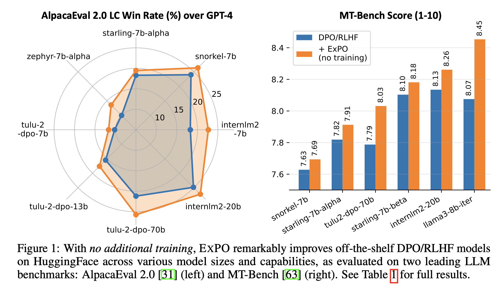
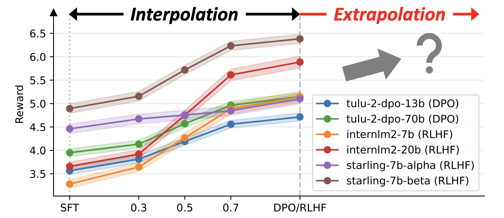
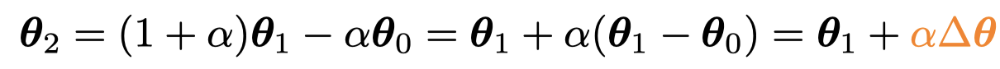
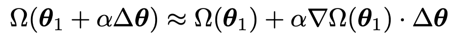
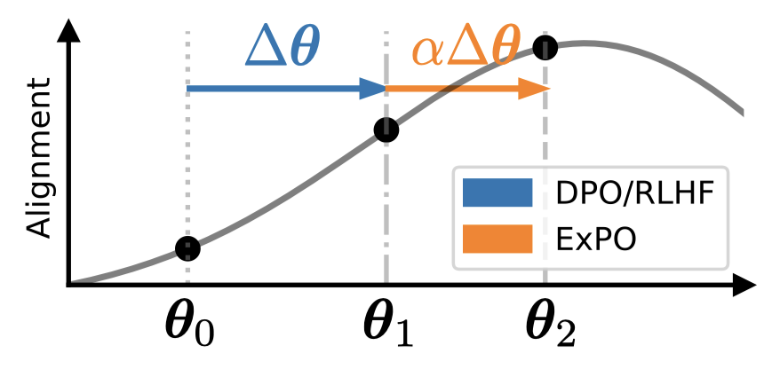
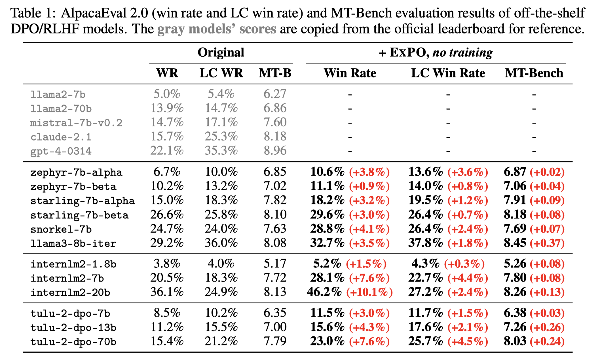
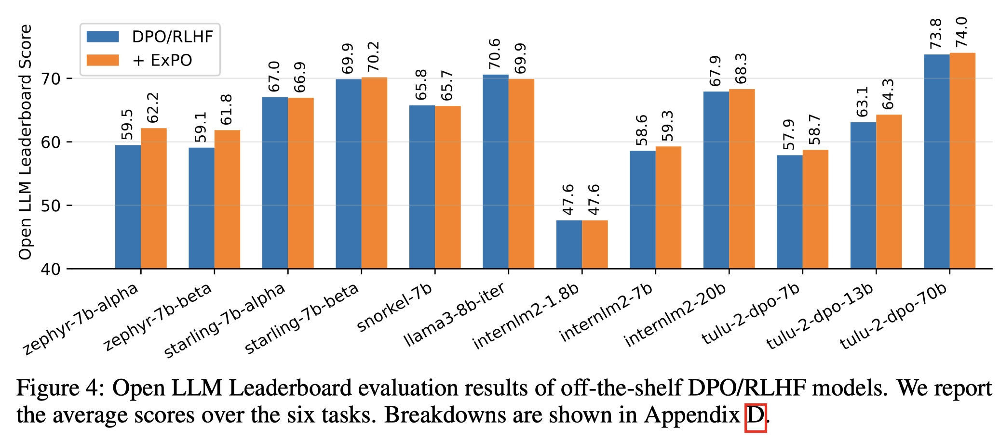

# LLM-Extrapolation

Official repository for paper "[Weak-to-Strong Extrapolation Expedites Alignment](https://arxiv.org/abs/2404.16792)" [[tweet]](https://twitter.com/ChujieZheng/status/1783911895088632175)

If you find this repository useful or our work is related to your research, please kindly cite it:
```
@article{
  llm-extrapolation,
  title={Weak-to-Strong Extrapolation Expedites Alignment},
  author={Chujie Zheng and Ziqi Wang and Heng Ji and Minlie Huang and Nanyun Peng},
  journal={arXiv preprint arXiv:2404.16792},
  year={2024}
}
```

## News

* **[05/2024]** We have made a revision to the [ExPO paper](https://arxiv.org/abs/2404.16792), adding the basic theoretical explanation and more comprehensive evaluation (more benchmarks and models). Overall, ExPO is **<font color="red">extremely simple, efficient, and scalable</font>**. Try it to boost your aligned LLMs!
* **[05/2024]** We are constantly uploading new **ExPO**-enhanced LLMs to [🤗 HuggingFace](https://huggingface.co/collections/chujiezheng/weak-to-strong-extrapolation-expedites-alignment-662b69fbe7850e722e10ff70) (e.g., LLaMA-3 models, from 8B to 70B). You can give them a try!
* **[05/2024]** Our uploaded **ExPO**-enhanced LLMs have received **<font color="red">10K+ downloads in 2 weeks</font>** on [🤗 HuggingFace](https://huggingface.co/collections/chujiezheng/weak-to-strong-extrapolation-expedites-alignment-662b69fbe7850e722e10ff70)!

## Introduction

This work presents **ExPO**, an extremely simple method to boost LLMs' alignment with human preference via **weak-to-strong model extrapolation**

<div align="center">

</div>

ExPO is inspired by *model interpolation*. We find that interpolating between the weights of a DPO/RLHF model and its initial SFT checkpoint usually results in in-between performance. Then, ***what if we consider a DPO/RLHF model as the interpolated result from the initial SFT model and a hypothetically better-aligned model?***

<div align="center">

</div>

ExPO is extremely simple and efficient, which can be implemented in a few lines of code (as in `extrapolate.py`)

<div align="center">

</div>

Theoretically, ExPO takes first-order approximation to implicitly optimize the alignment objective

<div align="center">

</div>

<div align="center">

</div>

ExPO is also scalable across models of various sizes and capabilities, as evaluated on AlpacaEval 2.0 and MT-Bench

<div align="center">

</div>

It has little impact on the base model's capability, as evaluated on Open LLM Leaderboard

<div align="center">

</div>

## Models

We have uploaded the trained checkpoints and extrapolated models on 🤗 HuggingFace.

For the extrapolated models applied to open-source models, see [this 🤗 HuggingFace collection](https://huggingface.co/collections/chujiezheng/weak-to-strong-extrapolation-expedites-alignment-662b69fbe7850e722e10ff70).

For the `zephyr` checkpoints trained from `zephyr-7b-sft-full` in our controlled experiments, see [this 🤗 HuggingFace collection](https://huggingface.co/collections/chujiezheng/model-checkpoints-in-the-expo-paper-662b00fde58d277c81fb5bfb).

## Implementation of ExPO

The implementation of ExPO is extremely simple. You can refer to the code `extrapolate.py` (setting alpha to 0.3 or 0.5 is usually good).

## Experimental Results

You can find the raw outputs of the standardized benchmarks AlpacaEval 2.0 (`results_alpaca`), MT-Bench (`results_mtbench`), and Open LLM Leaderboard (`results_lmeval`). For Open LLM Leaderboard, you can find the scores of the non-existing models from the [official leaderboard](https://huggingface.co/spaces/HuggingFaceH4/open_llm_leaderboard).

We have also uploaded the AlpacaEval 2.0 evaluation results to the [official leaderboard](https://tatsu-lab.github.io/alpaca_eval/). You can find the detailed inference hyperparameters in their repository for reproduction.

## Inference and Evaluation Code

The inference code includes `generate_ultrafeedback.py` and `generate_alpaca.py`. The script `scripts/Starling-LM-7B-beta_extra.sh` shows:

* Do model extrapolation (ExPO) with a DPO/RLHF and its initial SFT checkpoints
* Use a HuggingFace model to generate responses on UltraFeedback or AlpacaEval 2.0. The outputs will be saved to `outputs_ultrafeedback` or `outputs_alpaca`
* Score the outputs using the reward model. The reward scores will be saved to `rewards_ultrafeedback` or `rewards_alpaca`

For the part of evaluation on standardized benchmarks:

* To run the official AlpacaEval 2.0 evaluation, follow https://github.com/tatsu-lab/alpaca_eval?tab=readme-ov-file#evaluating-a-model
* To run the official MT-Bench evaluation, follow https://github.com/lm-sys/FastChat/tree/main/fastchat/llm_judge (you can host the local vllm server to speed up inference)
* To run the official Open LLM Leaderboard evaluation, follow https://huggingface.co/spaces/HuggingFaceH4/open_llm_leaderboard (About -> REPRODUCIBILITY)
